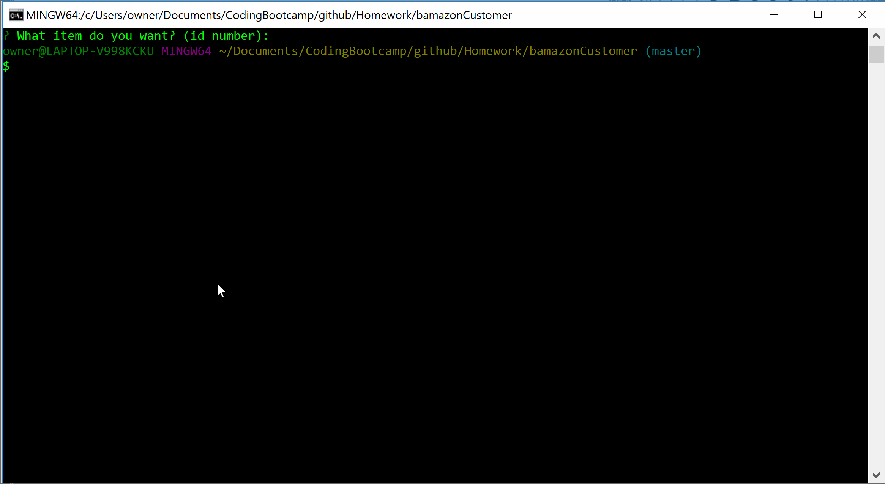
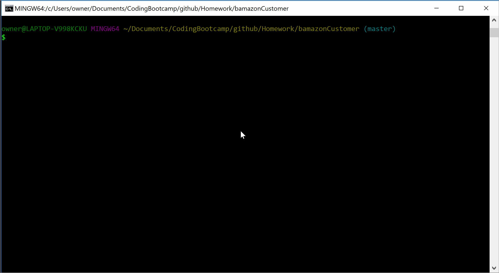
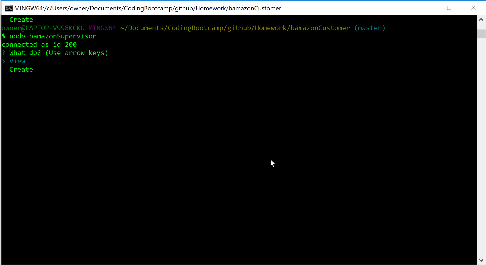

# bamazonCustomer

## 1. bamazonCustomer.js

Running script lists all rows and columns in table products. 
* 1st prompt: Gives option of buying product by entering product id.
* 2nd prompt: User enters quantity of products. 
When successful, quantity is subtracted from stock and (quantity * price) is added to product_sales.

## 2. bamazonManager.js

Running gives 4 options:
* All - Show all products
* Low - Shows all products with stock_quantity less than 5.
* Add - Adds to stock_quantity of existing products, user specifies product id and quantity to add.
* New - User adds new product (row in products table). Prompts ask for product name, department, price and stock quantity. 

## - bamazonSupervisor.js

Not fully functional. 

Running gives 2 options:
* View - Shows all rows and columns in departments table. Does not give sales figures, yet.
* Create - User creates new department. Prompts ask for department name and overhead costs. 

Included are .sql files to create bamazon database and the products and departments tables. 
